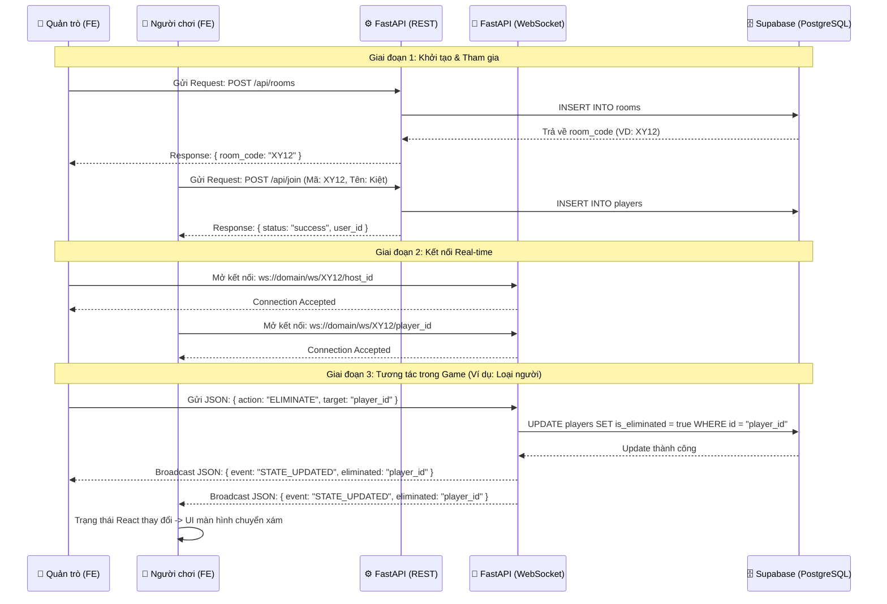

# WhoIsTheSpy
This website is used to support the game master (Moderator) in the game 'Who is the Spy'

# Who Is The Spy? - Real-time Web Game

A cross-platform web application (Mobile-first Web App) designed to help a game master (host) and a group of friends play the **"Who Is The Spy?"** board game offline effortlessly. It completely eliminates the time-consuming process of manually messaging each player. The project is highly optimized for mobile devices and synchronizes game states in real-time.

This project was developed as a **Pet Project** to apply the **Agile/Scrum** project management methodology, product design thinking, real-time database architecture, and user experience (UI/UX) optimization.

---

## Key Features

### For the Game Master 
- **Quick Room Creation:** The system automatically configures and generates a random Room Code to share with players.
- **Game Configuration:** Proactively set the number of spies and input the keyword pair (One word for citizens & One word for spies).
- **Flexible Role Assignment:** Supports automatic random role assignment by the system or manual assignment by the Host.
- **Round Logs:** Record the keywords and descriptions of each player per round so everyone can easily track the game's progress on a larger screen or personal phones.
- **Real-time Elimination:** Simply tap on a player's name to "blackout" (eliminate) them from the game when they are voted out.
- **Automated Result Calculation:** The system instantly analyzes win/loss conditions:
  - *Spies Win:* Number of alive spies = Number of alive citizens.
  - *Citizens Win:* All spies have been eliminated.

### For Players 
- **Easy Join:** Access the game via a mobile phone using the room code and a personal nickname without needing to create a complex account.
- **Keyword Security (Hold to Reveal):** Keywords are hidden by default as a card. Players must **Press and Hold** to view their word and release to hide it immediately, preventing neighbors from peeking.
- **Instant Synchronization:** Receive game state notifications (Game Started, Eliminated, Game Over) instantly from the Host without needing to reload the page.
- **Round Tracking Board:** View the list of descriptions from everyone in the room to make accurate voting decisions.

---

## Tech Stack

| Component | Technology | Reason for choosing |
| :--- | :--- | :--- |
| **Frontend** | **Next.js (React)** | Performance optimization, fast Server-Side Rendering (SSR), and powerful, flexible state/component management. |
| **Styling** | **Tailwind CSS** | Enables rapid UI development with a **Mobile-first** approach thanks to its convenient utility classes. |
| **Backend & DB** | **Supabase (PostgreSQL)** | Provides a robust Backend-as-a-Service (BaaS) ecosystem, highly secure with Row Level Security (RLS). |
| **Real-time** | **Supabase Realtime** | Listens directly to database changes via WebSockets, synchronizing state between the Host and Players with ultra-low latency. |
| **Deployment** | **Vercel** | The optimal hosting platform for Next.js with automated CI/CD directly from GitHub. |

---

## Architecture & Data Flow

### Database Schema

The project uses a relational PostgreSQL database on Supabase with a streamlined structure:

```sql
-- 1. Rooms Table: Manages room information
CREATE TABLE rooms (
    id UUID PRIMARY KEY DEFAULT gen_random_uuid(),
    room_code VARCHAR(10) UNIQUE NOT NULL,
    status VARCHAR(20) DEFAULT 'waiting', -- waiting, playing, finished
    spy_count INT DEFAULT 1,
    citizen_word VARCHAR(255),
    spy_word VARCHAR(255),
    winner VARCHAR(20) DEFAULT NULL,
    created_at TIMESTAMP WITH TIME ZONE DEFAULT NOW()
);

-- 2. Players Table: Manages the list of players in a room
CREATE TABLE players (
    id UUID PRIMARY KEY DEFAULT gen_random_uuid(),
    room_id UUID REFERENCES rooms(id) ON DELETE CASCADE,
    name VARCHAR(100) NOT NULL,
    role VARCHAR(20) DEFAULT 'citizen', -- citizen, spy
    is_eliminated BOOLEAN DEFAULT FALSE,
    is_host BOOLEAN DEFAULT FALSE,
    created_at TIMESTAMP WITH TIME ZONE DEFAULT NOW()
);

-- 3. Round_Descriptions Table: Stores the history of descriptions per round
CREATE TABLE round_descriptions (
    id UUID PRIMARY KEY DEFAULT gen_random_uuid(),
    room_id UUID REFERENCES rooms(id) ON DELETE CASCADE,
    player_id UUID REFERENCES players(id) ON DELETE CASCADE,
    round_num INT NOT NULL,
    description TEXT NOT NULL,
    created_at TIMESTAMP WITH TIME ZONE DEFAULT NOW()
);
### 🏗️ Kiến trúc hệ thống (System Architecture)

```mermaid
graph TD
    %% Định nghĩa các thiết bị Client
    subgraph Vercel [Frontend - Host trên Vercel]
        Host[👑 Quản trò (React/Next.js)]
        Player1[📱 Người chơi 1 (React/Next.js)]
        Player2[📱 Người chơi 2 (React/Next.js)]
    end

    %% Định nghĩa Backend Server
    subgraph Backend [Backend - Host trên Render/Docker]
        FastAPI[⚙️ FastAPI Server]
        WS_Manager[🔄 WebSocket Manager]
        FastAPI <-->|Quản lý luồng| WS_Manager
    end

    %% Định nghĩa Database
    subgraph Database [Database Cloud]
        Supabase[(🗄️ Supabase PostgreSQL)]
    end

    %% REST API flow (Đường đứt nét)
    Host -.->|POST /api/rooms| FastAPI
    Player1 -.->|POST /api/join| FastAPI
    Player2 -.->|POST /api/join| FastAPI

    %% WebSocket flow (Đường nét liền)
    Host <==>|ws://.../ws/room_code| WS_Manager
    Player1 <==>|ws://.../ws/room_code| WS_Manager
    Player2 <==>|ws://.../ws/room_code| WS_Manager

    %% DB flow
    FastAPI <-->|SQL Queries| Supabase
    
    classDef frontend fill:#3b82f6,stroke:#2563eb,stroke-width:2px,color:#fff;
    classDef backend fill:#10b981,stroke:#059669,stroke-width:2px,color:#fff;
    classDef db fill:#f59e0b,stroke:#d97706,stroke-width:2px,color:#fff;
    
    class Host,Player1,Player2 frontend;
    class FastAPI,WS_Manager backend;
    class Supabase db;
```

### 🔄 Luồng hoạt động (Sequence Diagram)


